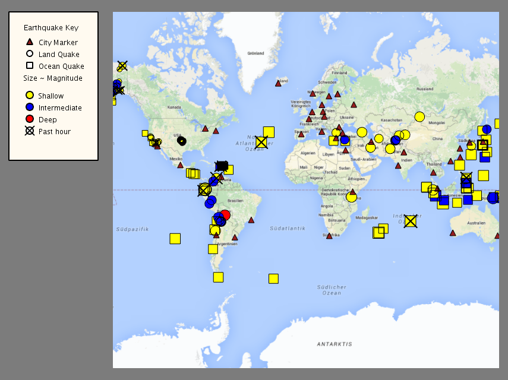
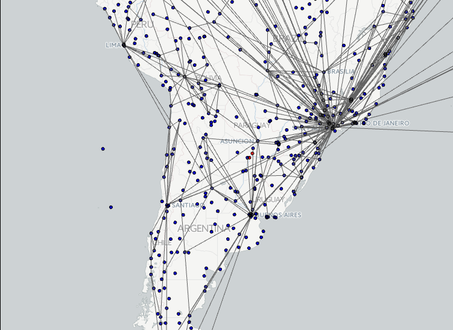

# Java Mapping Projects

This project represents my first foray into the wonderful world of Java. Working with some base code from UCSD, I worked through every step of creating a Global Earthquake Mapper applet. I then built an Airport Connection Map for a final project. Overall, Object Oriented Programming in Java was a great course, and gave me skills to think modularly and build complex projects with nice GUIs up with some base Java libraries.

## Global Earthquake Mapper

This project is a Java Applet that allows users to interact with a global map with markers representing earthquakes that have occurred within the last 24 hours and cities that may lie within their threat circle.

### The Data

The data for the Global Earthquake Mapper is retrieved from a government-curated [GeoRSS feed](http://earthquake.usgs.gov/earthquakes/feed/v1.0/summary/2.5_week.atom), which returns an XML document with the requested information. The ParseFeed class in the parsing package is given the URI for the feed and is responsible for retrieving the data and turning it into a list of PointFeatures. Other data, like those responsible for defining country borders and city locations, are kept in the data folder and are parsed into mappable objects by a special JSON reader class.

### The Main Code

The EarthquakeCityMap class is responsible for the setup of the Java applet, and thus contains much of the key logic to deal with user interaction. Upon instantiation, the EarthquakeCityMap creates a new UnfoldingMap object, creates lists of CityMarkers and EarthquakeMarkers--both classes defined within the package--as well as Markers representing countries from parsed data. The power of inheritance allows easy customization of the different types of markers, and thus allows the addition of methods like `threatCircle` to the EarthquakeMarker class:
```java
public double threatCircle() {
  double miles = 20.0f * Math.pow(1.8, 2 * getMagnitude() - 5);
  double km = (miles * kmPerMile);
  return km;
}
```
This method is used in the map class to filter markers when either a CityMarker or EarthquakeMarker is clicked. Usage of OOP concepts like inheritance, as well as Java-specific features like generics and interfaces, helped turn this project into a fantastic learning experience.

### The UI

The EarthquakeCityMap inherits from the the PApplet class, which allows for easy setup of a user interface, with simple event handling and layout design. Since the UnfoldingMap library is built on a Google Maps API, this also enables zooming and dragging to reposition the map.


*Above: Global Earthquake Mapper Applet*

The earthquake marker shapes are decided by whether they occurred on land or in the sea, determined by checking whether they are within the bounds of any country. Their size is determined by their magnitude. Cities are represented by triangular markers. Both cities and earthquakes can be clicked, the former to discover any earthquakes that may threaten it and the latter to discover any cities within its threat circle. Finally, earthquakes from the past hour are marked with an 'X'.

## Airport Connection Map

The Airport Connection Map project displays global airports and draws their connections when a user hovers over an airport marker. Again, the AirportMap class inherits from the PApplet class, which allows onHover and other mouse events to be overwritten and implemented simply. On instantiation, the AirportMap parses airport and route data into Marker and Feature subclasses, making them easy to use in conjunction with the UnfoldingMap object.


*Above: Airport Connection Mapper Applet showing connectivity of South American airports.*

Airports are represented on the map by navy circles. The user may click on these airports to indicate whether they have been visited or not. As stated, when the user hovers over an airport, all the route connections are displayed by the SimpleLineMarker class on the UnfoldingMap. Here, the connections are shown for all South American airports.
